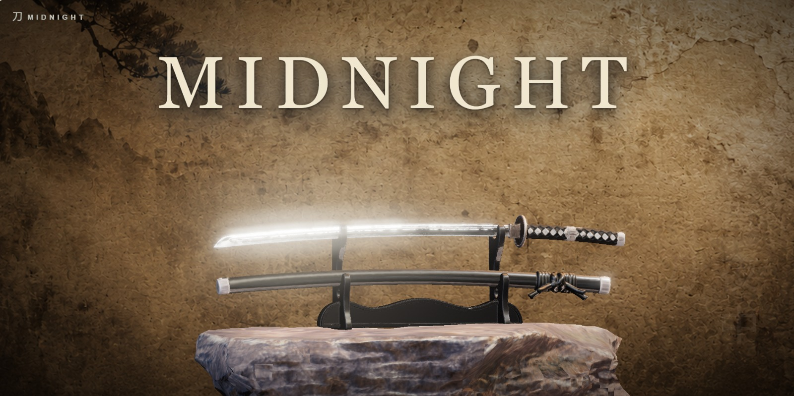
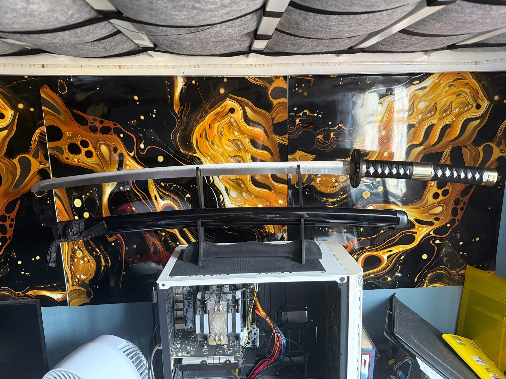
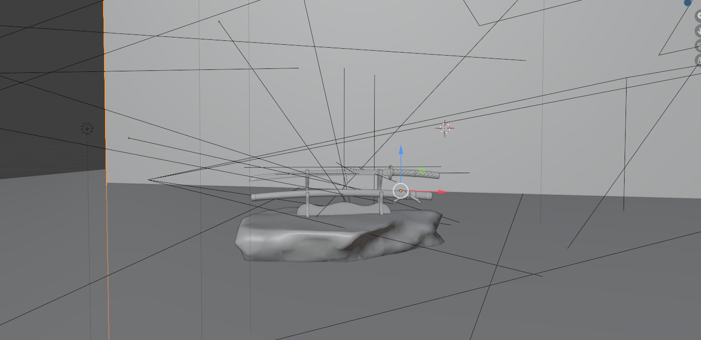
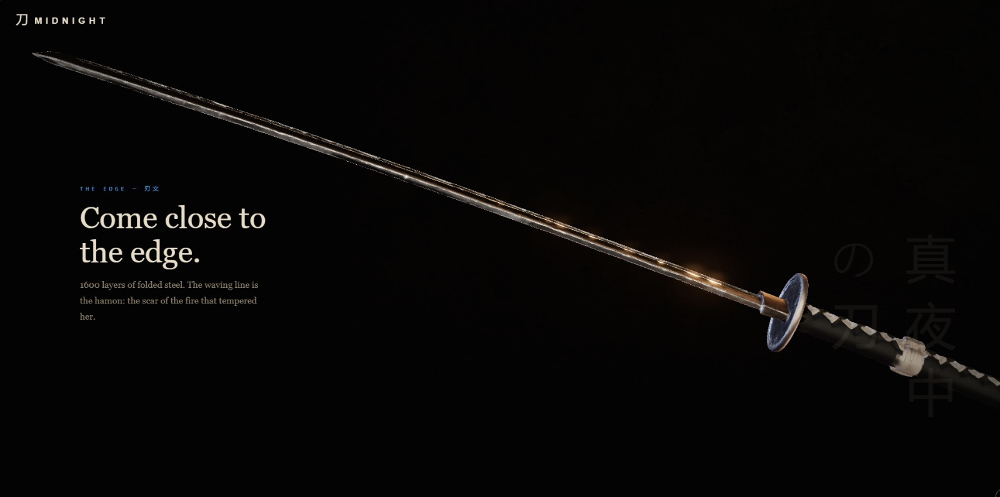
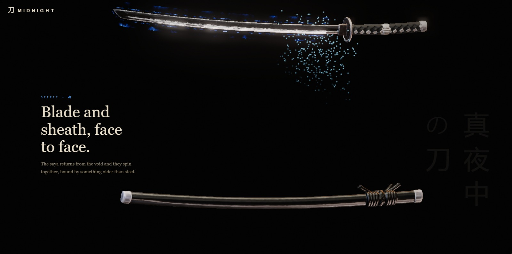
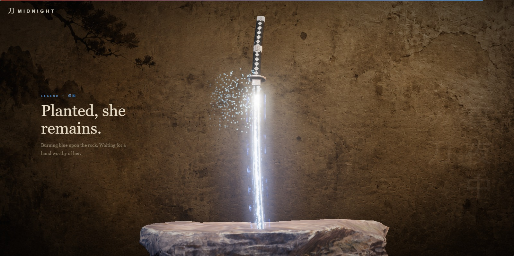

<div align="center">

# 刀 MIDNIGHT

### 真夜中の刀 — *The Midnight Blade*

**One katana. One cut. One legend.**

A scroll-driven WebGL experience rendered in real time — no video, no pre-rendered frames.

[**⛩️ Enter the experience → midnightz.netlify.app**](https://midnightz.netlify.app)

<br>



</div>

---

## The challenge

> *"Build a website about something in your room."*

This is what hangs above my desk:

<div align="center">



</div>

So I modeled her in Blender, gave her a legend, and built her a shrine on the web. Every scroll of the page is a chapter of her story.

<div align="center">

*From the wall to the viewport — the scene taking shape in Blender:*



</div>

---

## The experience

Scrolling drives a damped cinematic choreography through seven acts:

| Act | 章 | What happens |
|---|---|---|
| **Stillness** | 静寂 | The katana sleeps on volcanic rock |
| **Ascension** | 上昇 | The blade rises; the stand crumbles to sand beneath her |
| **The edge** | 刃文 | Macro flight along 1600 layers of folded steel — the hamon |
| **Ignition** | 青き炎 | Blue fire runs the blade from guard to tip |
| **Spirit** | 魂 | Blade and saya return from the void, spinning face to face |
| **The fall** | 一撃 | A single cut — the whole weight of the sky on the tip |
| **Legend** | 伝説 | Planted in the rock, burning blue, waiting for a worthy hand |

<br>







---

## How it's built

- **[three.js](https://threejs.org)** — real-time WebGL: `MeshPhysicalMaterial` steel and lacquer, ACES tone mapping, `UnrealBloomPass`, rect-area lighting
- **Custom GLSL shaders** — blue fire (core + aura), additive ember particles, sand dissolve, impact shockwave
- **GSAP ScrollTrigger + Lenis** — damped scroll choreography; the scrollbar is the timeline
- **Blender** — katana, saya, stand and rock modeled from the real sword; HDRI baked from the scene itself
- The blade feeds its albedo into its roughness map, so the bright hamon catches light differently than the folded steel around it

## Run locally

```bash
node server.js
```

Then open [http://localhost:8765](http://localhost:8765). No build step, no dependencies to install.

---

<div align="center">

## License

© 2026 [FaridDevU](https://github.com/FaridDevU) — **All rights reserved.**

Proprietary license: no copying, no derivatives, no redistribution, no reuse of any part
(code, models, shaders, design) without written permission. See [LICENSE](LICENSE).

<br>

**真夜中の刀** — *waiting for a hand worthy of her.*

</div>
